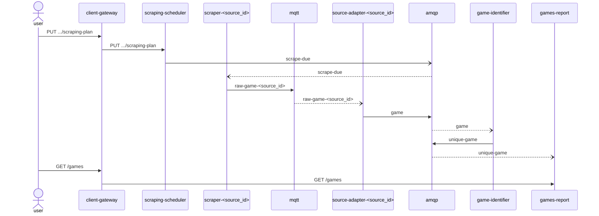

# game-collector

## Background

This is a system that collects games from various sources. 

The games are uniquely identifiable by a combination of the sport, compatition, and teams in a timeframe of two hours. 

The games should be exposed for querying.

## Requirements:

1. Collect unique games from multiple sources
2. Expose API for listing collected games

## Architecture

The system is based on microservices architecture, where services communicate indirectly via message brokers for event processing, or directly by HTTP requests for queries.
Below is the model, followed by a list of events (messages), followed by a list of services, followed by a sequence diagram to discribe the interaction.

Collection of raw data of games is performed by scheduling web scraping jobs to scrape the sources, where each scraper is designed to scrape only one source.
A source-specific adapter is transforming each raw game to a domain model game,

Splitting the raw game processing services and events per source may produce duplicate source code to some extent. However, the number of sources is not assumed to scale too much, and the benefit of adapting to changes in record structure of each separate source seems to worth it.

The raw games data is then processed to provide a unique set of games, to then get queried by clients.

### Model:

The following document represents the game model.

#### game

```json
{
  "start_time": <datetime>,
  "sport_type": <string>,
  "competition_name": <string>,
  "team_names": <array<string>>
}
```


### Events:

#### scrape-due

A scraping job request has been issued.

Payload:

```json
{
  "source_id": <string>,
  "created_at": <datetime>
}
```

#### raw-game-<source_id>

A source-specific game record has been scraped out of a source

Payload:

```json
{
  "source_id": <string>,
  <rest of structure depends on the source>
}
```

#### game

A game model record has been adapted from a source

Payload:

```json
{
  "source_id": <string>,
  "game": <game (model)>
}
```

#### unique-game

A new unique game has been collected

Payload:

```json
{
  "game": <game (model)>
}
```

### Services:

| Name                       | Functionality                                                              | Publishes          | Subscribes         | Queries/Commands (http)                      | Database                                                               |
|----------------------------|----------------------------------------------------------------------------|--------------------|--------------------|----------------------------------------------|------------------------------------------------------------------------|
| scraping-scheduler         | Configures and triggers scraping jobs for a source                         | scrape-due (amqp)  |                    | PUT /sources/{source_id}/scraping-plan       | Document (for scraping-plans)                                          |
| scraper-<source_id>        | Performs scraping jobs at the desired source, resulting in raw game events | raw-game-<source_id> (mqtt)    | scrape-due (amqp)  |                                              |                                                                        |
| source-adapter-<source_id> | Transforms source-specific game records to domain model game schema        | game (amqp)        | raw-game-<source_id> (mqtt)    |                                              |                                                                        |
| game-identifier            | Ignores duplicate games by uniquely identifying them                       | unique-game (amqp) | game (amqp)        |                                              | Document (for unique game indexing)                                    |
| games-report               | Stores and exposes games for query                                         |                    | unique-game (amqp) | GET /games?page={page}&page_size={page_size} | Document/Relational (for games dataset retrievals) |

### Other components:

* MQTT server: raw game events message borker, to provide channel for semi-structured game data originating at various external sources.
* AMQP server: message broker for domain events
* Client Gateway: Exposes the internal services to commands and queries from clients, while all other services mentioned above do not provide public access. May feature authorization, throttling, load-balancing, and other user-facing measures.



### Points of interest:

#### Raw game adaptation

A source website may display game information differently from another source. For example: `https://futbolme.com` displays the game labels in Spanish; other sources may refer to names such as the compatition name by domestic or international conventions.

That is why we consider the adaptation of a scraped source datum to be a separate task, for each scraper. This gives another benefit, which is gained in case we want to freely analyse the scraped raw data without having to change the adaptation logic.

#### Uniquely identifying games

Game objects are recieved as real-time events (or near real-time - that can be configured in `scraping-scheduler` service). This means we cannot simply use a traditional `SELECT DISTINCT`-like approach - the volume of duplicates-included objects accumulated in real-time may be too large for such a query to run efficiently. We need to processes them one-by-one checking every recieved game against all historical duplicates of that game, and remove duplicates while inserting to the storage.

A good practice for such a task is to use hash sets. Since the games are uniquely identifiable by a combination of fields, we can generate a hash key out of that composite, specifically - code similar to the following: 

```javascript
hours_from_epoch = get_hours_from_epoch(game.start_time.hours)
unique_key = hash(hours_from_epoch % 2, sport_type, competition_name, team_names[0], team_names[1], ...)
```

where `x % 2` is x modulus 2

The large volume mentioned above hints that we should not use in-memory for storing such a potentially huge hash set. Many database solutions support removing/ignoring dupliates while inserting, by declaring unique indexing on the `unique_key` field/property.

One good fit would be to use [MongoDB's unique indexes](https://www.mongodb.com/docs/v4.2/core/index-unique/): creating a unique index for `unique_key`, upserting the object `{unique_key}`, and catching the "duplicate key error". In that case, only a successful upsert (without errors) would result in publishing the unique-game domain event.

#### Querying games

The list of unique games is aggregated in `games-report` service. Further anaylsis of this list can (and generally-speaking should) be performed by processing the unique-game events in other flows and services. However this is a filtered collection of a model entity, and other parts of the system may be required to query games against this service as a source of truth.

For the choice of persistence, any database that supports efficient paging, is suitable for handling large data sets and can handle high traffic would do.
Some example candidates include MongoDB and PostgreSQL. If further analysis is expected to require complex queries, it may be worth to consider Postgres. Otherwise, we would be better off with Mongo as a simpler and more scalable solution.


